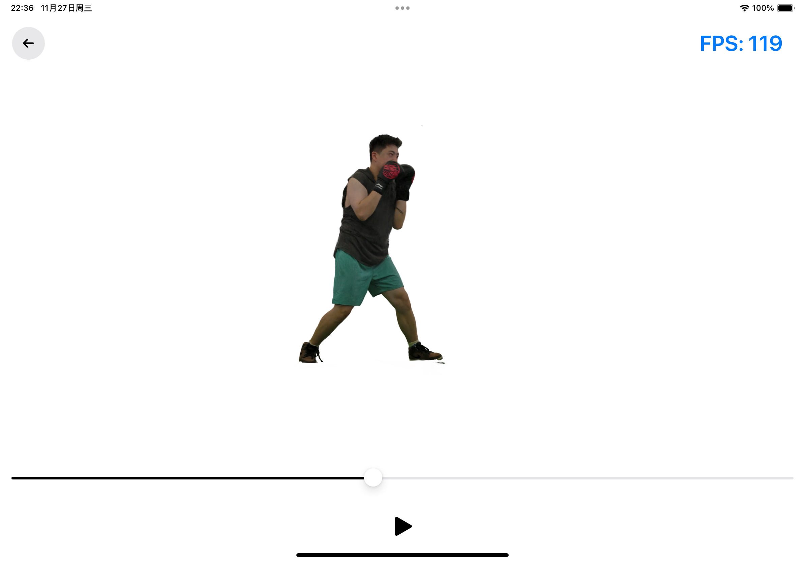

# Streaming Volumetric Video IOS Viewer for V3: Viewing Volumetric Videos on Mobiles via Streamable 2D Dynamic Gaussians

Official implementation of the streaming volumetric video viewer for _V^3: Viewing Volumetric Videos on Mobiles via Streamable 2D Dynamic Gaussians_.

**[Penghao Wang*](https://authoritywang.github.io/), [Zhirui Zhang*](https://github.com/zhangzhr4), [Liao Wang*](https://aoliao12138.github.io/), [Kaixin Yao](https://yaokxx.github.io/), [Siyuan Xie](https://simonxie2004.github.io/about/), [Jingyi Yu†](http://www.yu-jingyi.com/cv/), [Minye Wu†](https://wuminye.github.io/), [Lan Xu†](https://www.xu-lan.com/)**

**SIGGRAPH Asia 2024 (ACM Transactions on Graphics)**

| [Webpage](https://authoritywang.github.io/v3/) | [Paper](https://arxiv.org/pdf/2409.13648) | [Video](https://youtu.be/Z5La9AporRU?si=P95fDRxVYhXZEzYT) | [Training Code](https://github.com/AuthorityWang/VideoGS) | [SIBR Viewer Code](https://github.com/zhangzhr4/VideoGS_IOS_viewers) | [IOS Viewer Code](https://github.com/AuthorityWang/VideoGS_SIBR_viewers) |<br>


## Installation

### Dependencies
You need to download opencv2.framework and put it in the project folder. You can get the latest version in https://opencv.org/releases/.
### Project setup
First, you need to put the data folder in the folder of MetalSplat. We provide one checkpoint for testing. We have put two json files in MetalSplat folder and you need to download the video checkpoint from [this link](https://5xmbb1-my.sharepoint.com/:f:/g/personal/auwang_5xmbb1_onmicrosoft_com/Eld7m8aca11Kloo3rZuwYzQBYwxOuAa9q9JLsoZdT_bKPA?e=Ntv8yk) and put it to the same folder.

## Usage

Please compile the project in Xcode and build the project to your IOS device.

## Control

First, click the cover to load the volumetric video. Then you can use the following gestures to control the viewer:
- click the play button to play the video
- click the pause button to pause the video
- one finger for rotation
- two fingers for scaling and translation
- drag the slider to change the frame index
- click the back button to go back to the cover

## Code illustration
We implement a compute shader in `SplatShaders.metal` for fast conversion from 2D image to 3D splats.

## Streamable version
You can put the data folder on a server in the same network and change the path of data for loading streamable volumetric video.

## Acknowledgement

This viewer is based on the [metal splat viewer](https://github.com/laanlabs/metal-splats). 

If you found our work useful, please kindly cite our paper:

```
@article{wang2024v,
  title={V\^{} 3: Viewing Volumetric Videos on Mobiles via Streamable 2D Dynamic Gaussians},
  author={Wang, Penghao and Zhang, Zhirui and Wang, Liao and Yao, Kaixin and Xie, Siyuan and Yu, Jingyi and Wu, Minye and Xu, Lan},
  journal={ACM Transactions on Graphics (TOG)},
  volume={43},
  number={6},
  pages={1--13},
  year={2024},
  publisher={ACM New York, NY, USA}
}
```
